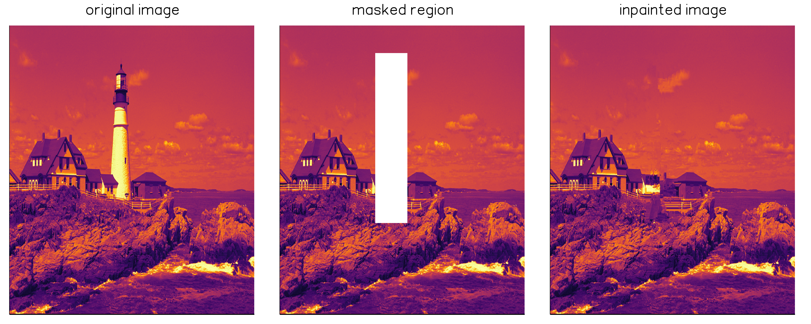

# ImageInpainting.jl

[![][travis-img]][travis-url]
[![][pkgeval-img]][pkgeval-url]
[![][codecov-img]][codecov-url]

Image inpainting algorithms in Julia.

For those situations where we need to remove undesired elements from the scene...



**Obs:** Currently, only single channel images are supported.

## Installation

Get the latest stable release with Julia's package manager:

```julia
Pkg.add("ImageInpainting")
```

## Usage

```julia
using ImageInpainting

# inpaint image within mask using algorithm
inpaint(img, mask, algo)
```
where `mask[i,j,...]` is set to `true` whenever a pixel is to be inpainted.

Examples of usage for each algorithm can be found in the test folder.

## Algorithms

| Algorithm type | References |
|----------------|------------|
| `Criminisi` | Criminisi, A., Pérez, P., Toyama, K., 2004. Region Filling and Object Removal by Examplar-based Image Inpainting. |

## Contributing

Contributions are very welcome, as are feature requests and suggestions.

Please [open an issue](https://github.com/JuliaImages/ImageInpainting.jl/issues) if you encounter
any problems.


<!-- URLS -->

[pkgeval-img]: https://juliaci.github.io/NanosoldierReports/pkgeval_badges/I/ImageInpainting.svg
[pkgeval-url]: https://juliaci.github.io/NanosoldierReports/pkgeval_badges/report.html
[travis-img]: https://travis-ci.com/JuliaImages/ImageInpainting.jl.svg?branch=master
[travis-url]: https://travis-ci.com/JuliaImages/ImageInpainting.jl
[codecov-img]: https://codecov.io/gh/juliaimages/ImageInpainting.jl/branch/master/graph/badge.svg
[codecov-url]: https://codecov.io/gh/juliaimages/ImageInpainting.jl
